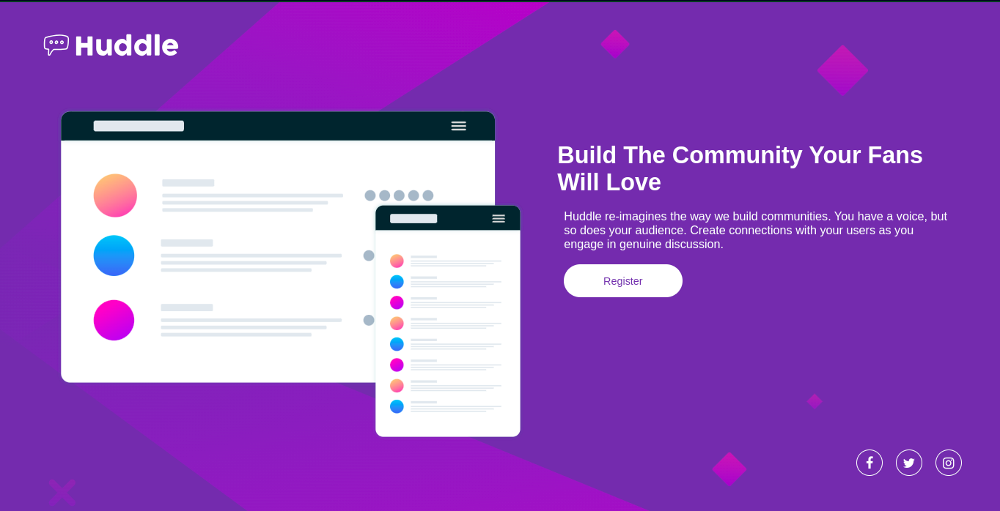

# Frontend Mentor - Huddle landing page with single introductory section solution

This is a solution to the [Huddle landing page with single introductory section challenge on Frontend Mentor](https://www.frontendmentor.io/challenges/huddle-landing-page-with-a-single-introductory-section-B_2Wvxgi0). Frontend Mentor challenges help you improve your coding skills by building realistic projects. 

## Table of contents

- [Overview](#overview)
  - [The challenge](#the-challenge)
  - [Screenshot](#screenshot)
  - [Links](#links)
- [My process](#my-process)
  - [Built with](#built-with)
  - [What I learned](#what-i-learned)
  - [Continued development](#continued-development)
  - [Useful resources](#useful-resources)
- [Author](#author)


## Overview

### The challenge

Users should be able to:

- View the optimal layout for the page depending on their device's screen size
- See hover states for all interactive elements on the page

### Screenshot



### Links

- Solution URL: [Add solution URL here](https://your-solution-url.com)
- Live Site URL: [Add live site URL here](https://your-live-site-url.com)

## My process

### Built with

- Semantic HTML5 markup
- CSS custom properties
- Flexbox
- Mobile-first workflow
- Sass

## Technologies


### What I learned

This is a simple project, where you could practice some previous knowledge in html and scss, but in this project I wanted to experiment with sass to learn more about this technology which makes things easier and saves css code, with sass I didn't use the mixins.

```html
<div class="user">
      <h1 class="title">Build The Community Your Fans Will Love</h1>
      <p class="paragraph">Huddle re-imagines the way we build communities. You have a voice, but so does your audience. Create connections with your users as you engage in genuine discussion.</p>
      <button class="btn">Register</button>
    </div>
```
```css
:root {
  --font-headings: "Open Sans", sans-serif;
  --font-main: "Poppins", sans-serif;
  --violet: hsl(257, 40%, 49%);
  --soft-magenta: hsl(300, 69%, 71%);
}
```
```sass
@use 'normalize';
@use 'contact';
@use 'main';
@use 'header';
@use 'media';
```

If you want more help with writing markdown, we'd recommend checking out [The Markdown Guide](https://www.markdownguide.org/) to learn more.


### Continued development

This is my first challenge with Frontend Mentor where I felt satisfied, but I want to continue carrying out projects to grow. In future projects I want to go deeper with sass and be able to use its more advanced aspects, I also want to use JavaScript and React.js in future challenges.


### Useful resources

- [Example resource 1](https://www.example.com) - This helped me for XYZ reason. I really liked this pattern and will use it going forward.
- [Example resource 2](https://www.example.com) - This is an amazing article which helped me finally understand XYZ. I'd recommend it to anyone still learning this concept.


## Author

- Website - [Add your name here](https://www.your-site.com)
- Frontend Mentor - [@alejuran](https://www.frontendmentor.io/profile/alejuran)
- Twitter - [@alejuran](https://twitter.com/alejuran)


# Huddle-landing-page
